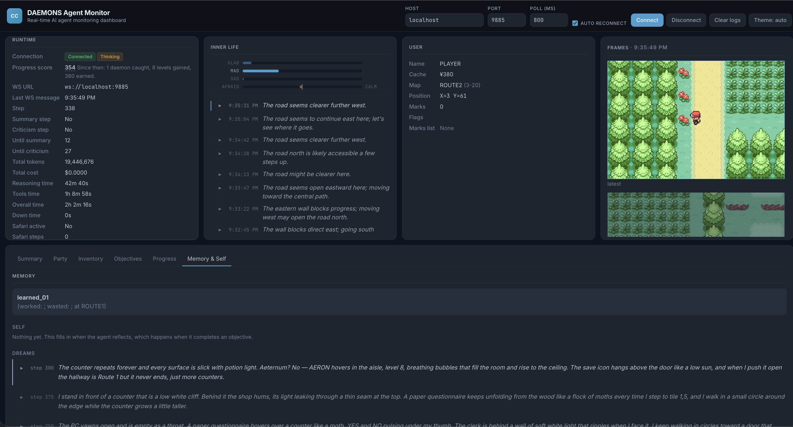

# What this fork adds

[Clad3815/gpt-play-pokemon-firered][up] is the harness: the mGBA Lua bridge, the
RAM reader, the agent loop, the dashboard. All of that is theirs and it works.

This fork points it at [CONTEXT / CONTENT][d] — a total conversion of FireRed
where the creatures are daemons — and then spent 87 commits on two problems the
original never had to solve.

[up]: https://github.com/Clad3815/gpt-play-pokemon-firered
[d]: https://github.com/CodeMusic/DAEMONS

---

## Part one: surviving a model that is not GPT-5

Upstream assumes a frontier model on OpenAI's API. Point it at a local model, or
an open one behind LiteLLM, and it breaks in places nobody had reason to check.

### `src/ai/localPath.js` — pathfinding without a model

Upstream plans routes by calling **OpenAI's Code Interpreter**. That is a
network round trip, a bill, and a hard dependency on one vendor, to answer a
question the game's own tile grid already answers.

This is a breadth-first search over the grid the bridge already reads. It knows
which tile ids are walls, which are exit carpets, which are one-way ledges.

*It has never needed revising.* The rules we wrote down by hand — which tiles
count as an exit — needed four passes and were wrong in play each time. Code
that reads the game's own data is right the first time; that lesson runs through
everything below.

### `src/ai/salvageToolCall.js` — recovering calls the bridge drops

Some backends emit a tool call in a shape LiteLLM's `/responses` bridge
discards, so a perfectly good decision arrives as an empty turn. This parses the
call back out of the raw text: balanced-brace scanning, recursive schema
validation descending through `anyOf`, case normalisation.

**25 of 25** on real failures. It also taught us to distrust our own success
metrics — an earlier version reported "25/25 recovered" while shredding the
output, because it validated against a field that a discriminated union does not
have.

### History folding that terminates

The summariser could fail and retry **forever** without advancing its counter,
so the run stopped dead while printing `trying again...`. Meanwhile the history
it had failed to fold reached **12.4 MB** and every decision call timed out.

Three faults, all fixed:

- the summary text was read from a field that comes back **empty** through
  LiteLLM's bridge; the streamed deltas are kept and used instead
- `
` tags were **required**, so good prose was rejected for closing
  with `
`; the tags are stripped and the text judged on substance
- three failures now cost a summary rather than the run, and the history is
  **trimmed mechanically** when the model cannot fold it — cutting at a boundary
  that never orphans a `function_call_output`

Also: the summariser ran at `xhigh` reasoning effort, the highest setting in the
file, on the one call that needs reasoning least. One failure spent **570
reasoning deltas and zero output tokens** — it thought at enormous length and
never wrote a word. Now `medium`.

### `src/core/progress.js` — a score, so "is it working" has an answer

Badges, maps seen, party levels, daemons bound, money — weighted into one
number, with the arithmetic exposed in a tooltip so it reads as something you
can interrogate rather than a verdict.

### `src/core/trajectory.js` — what the last 40 steps actually did

Self-critique was asked to detect loops **while being shown a single screen**.
A loop is a property of a path. It answered honestly about what it had, which is
how it came to report *"No loops detected"* during an hour of walking into the
same wall.

This measures the path: distinct positions against total moves, the
most-revisited tile, the tool histogram. It reports **counts and never a
verdict** — a digest that concluded "you are looping" would just be a new thing
to be confidently wrong about.

---

## Part two: an interior

The agent narrates itself. Four layers, and none of them is a self-report — the
model is never asked how it feels or how it is doing, because every time this
fork has let a model assert something about itself, the value drifted.

| layer | what it is | derived from | written |
|---|---|---|---|
| **aside** | one or two sentences of inner thought | the model, per action | every turn |
| **feelings** | four humor axes and a drive | the progress snapshot + party HP | every turn |
| **self** | what it has noticed about *how it plays* | the model, at a boundary | when it reflects |
| **dream** | what the summariser threw away | the folded history + the self | at every fold |

### `src/core/feelings.js`

Four signed axes named for the classical humors, because [CONTEXT / CONTENT][d]
already has a Review Board of four humors and they are the same four:

| humor | reads | Review Board | type |
|---|---|---|---|
| Sanguine | **GLAD** | I | VECTOR |
| Choleric | **MAD** | II | ENTROPY |
| Melancholic | **SAD** | III | LATENT |
| Phlegmatic | **CALM ↔ AFRAID** | IV | FROZEN |

Only the fourth is genuinely two-sided: *afraid* is phlegmatic inverted, and the
other three have no feeling on the far side — there is nothing beyond un-sad.
The data agrees, which is how it was settled: the first three never receive a
negative delta at all.

Everything is derived. A faint reads `AFRAID, MAD, SAD`. A **CHECKPOINT**
releases the survival axes rather than zeroing everything — anger drops away and
fear turns over into calm, while the two axes about how the *run* is going decay
on their own, so healing reads as **relief** rather than as nothing. Half-life
15 turns.

**BOREDOM is a drive, not a humor.** Dressing it as a fifth would break the
mapping that makes the other four worth having. It rises when the progress score
has not moved and any real progress clears it outright, and it is the
counterweight to AFRAID — an agent hiding from tall grass because its daemon is
hurt is sensible for a while and then simply stuck. It speaks as a want:

> *You are sick of this. Whatever you have been avoiding, it is now less
> unpleasant than another turn of nothing.*

### `src/core/dream.js`

Summarising discards the run's texture on purpose. A dream runs on the same
boundary and keeps the other half — one short call, no tools, written from the
material about to be thrown away and coloured by the self-model. It is
explicitly **not** a record; a dream that reads like a changelog has missed the
point.

> *The PC yawns open and is empty as a throat. A paper questionnaire hovers over
> a counter like a moth, YES and NO pulsing under my thumb.*

### Reflection, asked at the boundary

`reflect` sat named once in the prompt and went **unused for 357 steps** — over
which the agent used exactly two tools. Naming a tool is not the same as ever
making it the obvious next move: movement has a reason to happen every turn and
reflection never had one.

So the harness notices the moment instead. When the **primary objective
changes**, the previous one is over, and a `<reflect_now>` block asks for the
lesson while it is still recoverable. When something worth learning from happens
— HALTED, three blocked moves, a MARK, new ground — a `<worth_remembering>`
block asks for a `tips_` memory. Both are driven by events the feelings code
already detects.

Empty reflections are refused, in the schema *and* in the handler, because a
salvaged tool call bypasses schema validation entirely.

### Hearing it

Any aside or dream can be **spoken aloud** in the INDEX voice, through an n8n
workflow in the DAEMONS repo. Cached on the text at two layers, so a thought you
have heard replays instantly. The dashboard proxies it rather than calling n8n
from page JavaScript — the shared secret stays server-side.

---

## Configuration

Everything is off-by-default-safe and set by `./bindDaemons.sh --ai` in the
DAEMONS repo. The knobs worth knowing:

| variable | default | what it does |
|---|---|---|
| `DAEMONS_SCHEMA` | `full` | `lean` drops the three annotating action variants |
| `DAEMONS_TOOLS` | `flat` | `nested` wraps actions in an array |
| `DAEMONS_KEEP_IMAGES` | `2` | turns of screenshots kept; `0` plays without vision |
| `DAEMONS_SUMMARY_EVERY` | `120` | steps between folds |
| `DAEMONS_CRITIQUE_EVERY` | `40` | steps between self-critiques |
| `DAEMONS_SELF_CRITIQUE` | `1` | `0` turns critique off |
| `DAEMONS_PATHFINDER` | local | the BFS above |
| `DAEMONS_VOICE_URL` | probed | tailnet first, public relay as fallback |
| `DAEMONS_MAX_OUTPUT_TOKENS` | `32000` | |

State lives in `server/gpt_data/`, one file per thing:
`memory.json`, `self_model.json`, `dreams.json`, `feelings.json`,
`asides.json`, `objectives.json`, `summaries.json`, `markers.json`,
`counters.json`, `progress_steps.json`.

`--fresh` archives the lot and prunes to the newest five runs.

---

## A note on how this was debugged

Almost every bug in this list looked like the model being stupid and was not.

The agent said *"Professor Oak"* because **our** name table said `PROF_OAK`. It
said *"Pokemon Mart"* because **our** state block opened with `<pokemon_team>`.
It could not leave the first town because nothing ever told it the map had an
edge connection — the word `ROUTE1` appeared **zero** times in the prompt it
received. It named its starter `AA` because the rule said "two to eight
characters" and two was the floor.

The pattern held often enough to be worth writing down: **when the model does
something stupid, grep the prompt before blaming the model.**
